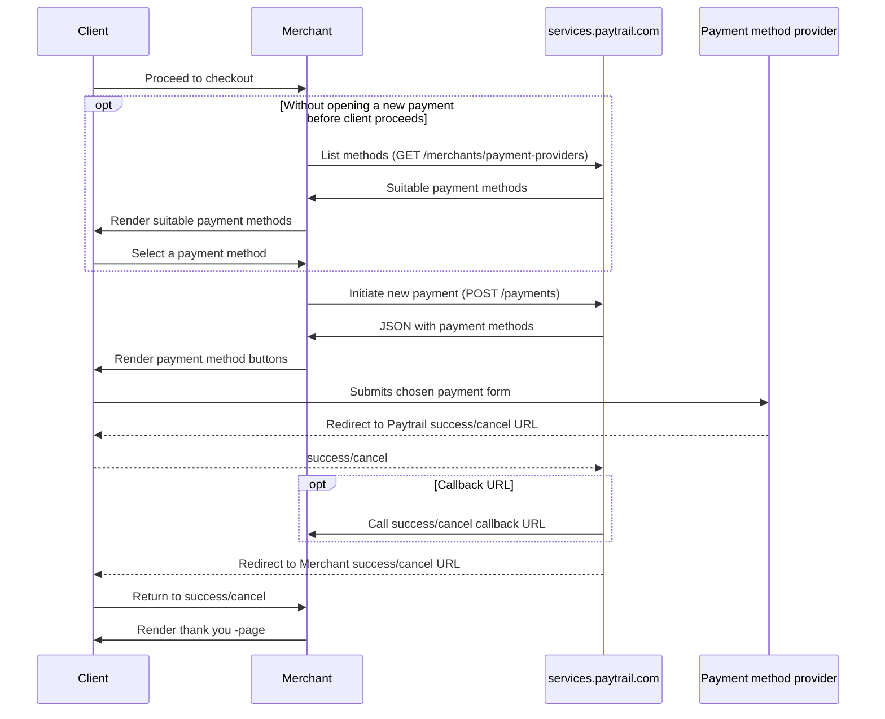
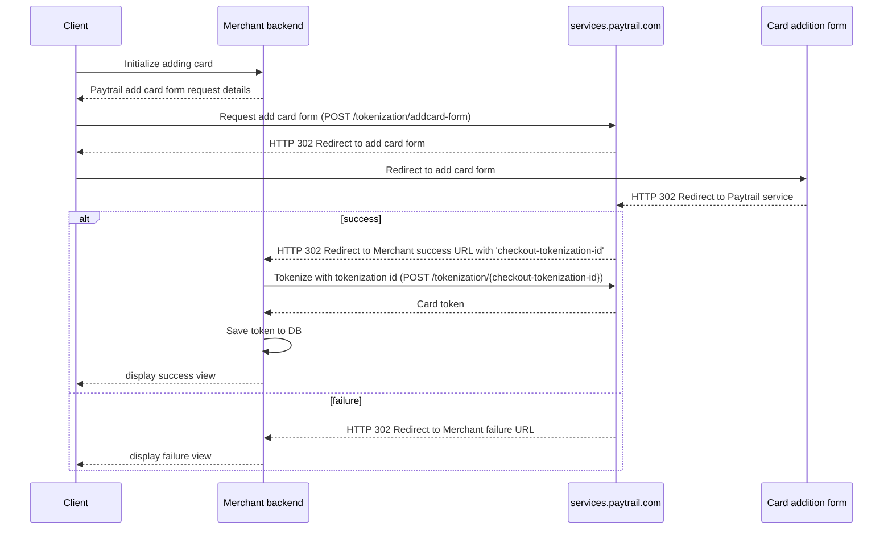
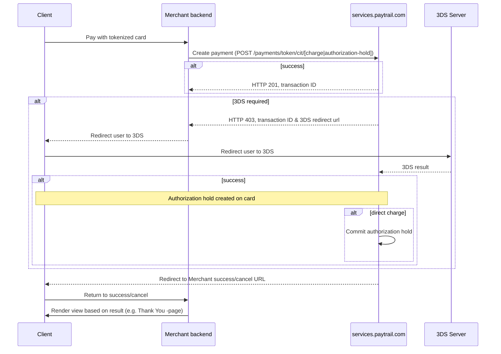

# Paytrail Payment API

This is the API reference and example documentation for the new [Paytrail](https://www.paytrail.com/) Payment API.

OpenAPI 3 specification for the API is also [available for download](paytrail-api.yaml ':ignore').

?> If you have any feedback regarding how we could improve the documentation, [please file an issue on Github](https://github.com/paytrail/api-documentation/issues). You can also ask for support by opening an issue on GitHub. Thank you!

## API endpoint

API endpoint is `services.paytrail.com`.

## Authentication

All API calls need to be signed using HMAC and SHA-256 or SHA-512. When a request contains a body, the body must be valid JSON and a `content-type` header with the value `application/json; charset=utf-8` must be included.

All API responses are signed the same way, allowing merchant to verify response validity. In addition, the responses contain `request-id` header. Saving or logging the value of this header is recommended.

The signature is transmitted in the `signature` HTTP header. Signature payload consists of the following fields separated with a line feed (`\n`). Carriage returns (`\r`) are not supported.

- All `checkout-` headers in alphabetical order. The header keys must be in lowercase. Each header key and value are separated with `:`
- HTTP body in exactly the same format as it will be sent, or empty string if no body

The headers are:

| Field                     | Type    | Description                                                                                                                                                                                                                                                                                                                                                             |
| ------------------------- | ------- | ----------------------------------------------------------------------------------------------------------------------------------------------------------------------------------------------------------------------------------------------------------------------------------------------------------------------------------------------------------------------- |
| `checkout-account`        | numeric | Paytrail account ID, e.g. `375917`                                                                                                                                                                                                                                                                                                                                      |
| `checkout-algorithm`      | string  | Used signature algorithm, either `sha256` or `sha512`                                                                                                                                                                                                                                                                                                                   |
| `checkout-method`         | string  | HTTP verb of the request, either `GET` or `POST`                                                                                                                                                                                                                                                                                                                        |
| `checkout-nonce`          | string  | A unique value (e.g., UUID) required for each request, used to prevent replay attacks. Duplicate nonces may be rejected                                                                                                                                                                                                                                                 |
| `checkout-timestamp`      | string  | ISO 8601 date time                                                                                                                                                                                                                                                                                                                                                      |
| `checkout-transaction-id` | string  | Paytrail transaction ID when accessing single transaction - not required for a new payment request                                                                                                                                                                                                                                                                      |
| `platform-name`           | string  | For SaaS services, use the marketing name of the platform (for example, `shopify`). For third party eCommerce platform plugins, use the platform name and your identifier, like company name (for example, `woocommerce-yourcompany`). Platform and integrator information helps customer service to provide better assistance for the merchants using the integration. |

The HTTP verb, nonce and timestamp are used to mitigate various replay and timing attacks. Below is an example payload passed to a HMAC function:

```
checkout-account:1234\n
checkout-algorithm:sha256\n
checkout-method:POST\n
checkout-nonce:1234\n
checkout-timestamp:2018-07-05T11:19:25.950Z\n
REQUEST BODY
```

See also code examples of [HMAC calculation in node.js](/examples#hmac-calculation-nodejs) and [HMAC calculation in PHP](/examples#hmac-calculation-php).

### Test credentials

Please note that not all payment methods support testing, so only the payment methods that support testing payments are enabled for these credentials. Provider specific credentials for approving payments can be found from [providers tab](/payment-method-providers#test-credentials). Payments created with test accounts will be removed daily which means older payments cannot be refunded.

#### Normal merchant account

- Merchant ID: `375917`
- Secret key: `SAIPPUAKAUPPIAS`

#### Shop-in-Shop merchant account

_Note:_ Use these only if you are setting up a [Shop-in-Shop](https://www.paytrail.com/blog/shop-in-shop-kauppapaikat-miksi-ja-kenelle) web shop.

- Aggregate merchant ID: `695861`
- Aggregate secret key: `MONISAIPPUAKAUPPIAS`
- Shop-in-Shop merchant ID: `695874`

When opening a shop-in-shop payment, the request is signed with the aggregate merchant ID and secret key. Each item in a shop-in-shop payment request must list a valid shop-in-shop merchant ID. Aggregate merchant cannot be used in items.

### Redirect and callback URL signing

Return and callback URL parameters are also signed, and the merchant _must_ check the signature validity. The signature is calculated the same way as for requests, but the values come in as query string parameters instead of headers. Empty string is used for the body.

## Payments

Actions related to the payment object are mapped to `/payments` API endpoint.

The following illustrates how the user moves in the payment process.



### Create

`HTTP POST /payments` creates a new open payment and returns a JSON object that includes the available payment methods. The merchant web shop renders HTML forms from the response objects (see [example](/examples#payment-provider-form-rendering)). The client browser will submit the form to the payment method provider.

Once the payment has been completed the client browser will return to the merchant provided redirect URL.

[List providers](#list-providers) endpoint can be used to receive available payment methods without opening a new payment.

#### Request

See all available fields from [create payment request body section](#create-payment).

```json
{
  "stamp": "d2568f2a-e4c6-40ba-a7cd-d573382ce548",
  "reference": "9187445",
  "amount": 1590,
  "currency": "EUR",
  "language": "FI",
  "items": [
    {
      "unitPrice": 1590,
      "units": 1,
      "vatPercentage": 25.5,
      "productCode": "#927502759",
      "stamp": "10743336-b969-4d5c-87f7-0ef8594d24ef"
    }
  ],
  "customer": {
    "email": "erja.esimerkki@example.org"
  },
  "redirectUrls": {
    "success": "https://ecom.example.org/success",
    "cancel": "https://ecom.example.org/cancel"
  },
  "callbackUrls": {
    "success": "https://ecom.example.org/success",
    "cancel": "https://ecom.example.org/cancel"
  }
}
```

#### Response

See detailed [response documentation](#create-payment) for explanation.

```json
{
  "transactionId": "5770642a-9a02-4ca2-8eaa-cc6260a78eb6",
  "href": "https://services.paytrail.com/pay/5770642a-9a02-4ca2-8eaa-cc6260a78eb6",
  "reference": "809759248",
  "terms": "By continuing with your payment, you agree to our <a href=\"https://www.checkout.fi/ehdot-ja-sopimukset/maksuehdot\" target=\"_blank\">payment terms & conditions</a>",
  "groups": [
    {
      "id": "mobile",
      "name": "Mobile payment methods",
      "icon": "https://static.paytrail.com/static/img/payment-groups/mobile.png",
      "svg": "https://static.paytrail.com/static/img/payment-groups/mobile.svg"
    }
  ],
  "providers": [
    {
      "url": "https://maksu.pivo.fi/api/payments",
      "icon": "https://static.paytrail.com/static/img/pivo_140x75.png",
      "svg": "https://static.paytrail.com/static/img/payment-methods/pivo-siirto.svg",
      "name": "Pivo",
      "group": "mobile",
      "id": "pivo",
      "parameters": [
        {
          "name": "amount",
          "value": "base64 MTUyNQ=="
        }
      ]
    }
  ],
  "customProviders": {
    "applepay": {
      "parameters": [
        {
          "name": "amount",
          "value": "15.25"
        }
      ]
    }
  }
}
```

#### Redirect and callback URL parameters

Once the payment is complete, or cancelled, the client browser is normally redirected to the merchant provided URL. If merchant has provided a callback URL, it will be called too. The callback is called with `HTTP GET` and with the same query string parameters as in the redirect. The callback URL should respond with `HTTP 20x`.

!> The URLs may be called multiple times. The merchant web shop must be able to handle multiple requests for the same purchase.

The payment information is available in the query string parameters of the client request. For example, if the `redirectUrls.success` value was `https://example.org`, it would be accessed with parameters appended:

```
https://example.org?checkout-account=375917&checkout-algorithm=sha256&checkout-amount=2964&checkout-stamp=15336332710015&checkout-reference=192387192837195&checkout-transaction-id=4b300af6-9a22-11e8-9184-abb6de7fd2d0&checkout-status=ok&checkout-provider=nordea&signature=b2d3ecdda2c04563a4638fcade3d4e77dfdc58829b429ad2c2cb422d0fc64080
```

?> Maximum length of success and cancel url is 300 characters, and callback url 3000 characters.

The query string parameters are listed below. If callback URLs were provided, same parameters are used.

| Field                           | Type    | Description                                                                                                                                                                                                                                                                                                                                            |
| ------------------------------- | ------- | ------------------------------------------------------------------------------------------------------------------------------------------------------------------------------------------------------------------------------------------------------------------------------------------------------------------------------------------------------ |
| `checkout-account`              | numeric | Paytrail account ID                                                                                                                                                                                                                                                                                                                                    |
| `checkout-algorithm`            | string  | Used signature algorithm. The same as used by merchant when creating the payment.                                                                                                                                                                                                                                                                      |
| `checkout-amount`               | numeric | Payment amount in currency minor unit, e.g. cents. Maximum value of 99999999.                                                                                                                                                                                                                                                                          |
| `checkout-settlement-reference` | string  | Payment reference of the settlement in which the succeeded transaction will be included in.<br><br>**Note:** This field will be provided only for specific Suomi.fi -merchants and only when calling success-callback.                                                                                                                                 |
| `checkout-stamp`                | string  | Merchant provided stamp. Maximum of 200 characters.                                                                                                                                                                                                                                                                                                    |
| `checkout-reference`            | string  | Merchant provided reference. Maximum of 200 characters.                                                                                                                                                                                                                                                                                                |
| `checkout-transaction-id`       | string  | Paytrail provided transaction ID.<br><br>**Note:** In case of refund request that fails in semantic validation (e.g. insufficent account balance), this field will not be provided since the refund transaction does not exist yet. <br><br>**Important:** Store the value. It is needed for other actions such as refund or payment information query |
| `checkout-status`               | string  | Payment status, either `ok`, `pending`, `delayed`, or `fail`. See [statuses](#statuses) section for more information.                                                                                                                                                                                                                                  |
| `checkout-provider`             | string  | The payment method provider the client used. Current values are documented on [providers tab](/payment-method-providers#test-credentials). The values are subject to change without notice.                                                                                                                                                            |
| `signature`                     | string  | HMAC signature calculated from other parameter                                                                                                                                                                                                                                                                                                         |

Merchant must check that signature is valid. Signature is calculated as described [above](#redirect-and-callback-url-signing). **Do not** implement the HMAC validation with hardcoded query string parameters since new ones may be added later. Instead, filter parameters by name (include all that begin with `checkout-`), then sort, and calculate the HMAC.

##### Statuses

The currently possible payment statuses are:

| Status    | Description                                                                                                                                                                                                                                                                                                      |
| --------- | ---------------------------------------------------------------------------------------------------------------------------------------------------------------------------------------------------------------------------------------------------------------------------------------------------------------- |
| `new`     | Payment has been created but nothing more. Never returned as a result, but can be received from the `GET /payments/{transactionId}` endpoint                                                                                                                                                                     |
| `ok`      | Payment was accepted by the provider and confirmed successfully                                                                                                                                                                                                                                                  |
| `fail`    | Payment was cancelled by the user or rejected by the provider                                                                                                                                                                                                                                                    |
| `pending` | Payment was initially approved by the provider but further processing is required, used in e.g. these cases: <br><br> 1. anti-fraud check is ongoing<br> 2. invoice requires manual activation<br>3. Refund has been initiated but waiting for approval (only used for merchants which require refund approvals) |
| `delayed` | A rare status related to a single payment method that is not generally enabled. May take days to complete. If completed, will be reported as `ok` via the callback _or_ the redirect URL. This can be handled the same way as `pending`.                                                                         |

### Get

`HTTP GET /payments/{transactionId}` returns payment information.

Get transaction info. Payments are reported primarily via callbacks, and implementations should mainly rely on receiving the info via them. All received payments will be eventually reported.

<b>Note!</b> The transaction id needs to be sent on checkout-transaction-id header as well.

#### Response

| Field               | Type     | Description                                                                                                          |
| ------------------- | -------- | -------------------------------------------------------------------------------------------------------------------- |
| transactionId       | string   | Assigned transaction ID for the payment                                                                              |
| status              | string   | `new`, `ok`, `fail`, `pending`, or `delayed`. Statuses are described [above](#statuses).                             |
| amount              | integer  | Total amount of the payment in currency's minor units, e.g. for Euros use cents                                      |
| currency            | alpha3   | Currency                                                                                                             |
| stamp               | string   | Merchant unique identifier for the order                                                                             |
| reference           | string   | Order reference                                                                                                      |
| createdAt           | string   | Transaction creation timestamp                                                                                       |
| href                | string   | If transaction is in status `new`, link to the hosted payment gateway                                                |
| provider            | string   | If processed, the name of the payment method provider                                                                |
| filingCode          | string   | If paid, the filing code issued by the payment method provider if any. Some providers do not return the filing code. |
| paidAt              | string   | Timestamp when the transaction was paid                                                                              |
| settlementReference | string   | If payment is settled, corresponding settlement reference is included                                                |
| cardInfo            | CardInfo | If it was a card payment, the card information is included when available                                            |

##### CardInfo

| Field       | Type   | Description                                               |
| ----------- | ------ | --------------------------------------------------------- |
| partialPan  | string | Last digits of payment cards Primary Account Number (PAN) |
| countryCode | string | The card issuers ISO 3166-1 alpha-2 country code          |
| bin         | string | The card issuers Bank Identification Number (BIN)         |

See [example response](/examples#get) from examples tab.

### Refund

`HTTP POST /payments/{transactionId}/refund` refunds a payment by transaction ID.

?>
Refunds can be asynchronous. Technically this means that when a refund request is accepted, the response may contain status `pending`. Later, when the refund is processed, the callback will be called with the actual outcome. At the moment, this only applies to email refunds but might be implemented for other types later.

#### Request

See detailed description from [refund payment request body section](#refund-payment).

```json
{
  "amount": 1590,
  "refundStamp": "88907910-7b85-4940-8563-202b93d5ca79",
  "refundReference": "your reference",
  "callbackUrls": {
    "success": "https://ecom.example.org/refund/success",
    "cancel": "https://ecom.example.org/refund/cancel"
  }
}
```

#### Response

| Status code | Explanation                                           |
| ----------- | ----------------------------------------------------- |
| 201         | Refund request received                               |
| 400         | Something went wrong                                  |
| 422         | Used payment method provider does not support refunds |

Note, that at the moment HTTP 400 may occur also for 3rd party reasons - e.g. because Nordea test API does not support refunds. See all provider limitations from [providers tab](/payment-method-providers#refunds).

```json
{
  "provider": "spankki",
  "status": "ok",
  "transactionId": "258ad3a5-9711-44c3-be65-64a0ef462ba3"
}
```

### Email refunds

`HTTP POST /payments/{transactionId}/refund/email` email refunds a payment by transaction ID.

?> Email refunds are always asynchronous. When a refund request is accepted, the response contain status `ok` and the callback will be called. The callback is not called with the actual outcome.

See detailed description from [refund payment request body section](#refund-payment).

```json
{
  "amount": 1590,
  "email": "recipient@example.com",
  "refundStamp": "bd71d096-94b6-4e1b-b4a3-d7cea73738ac",
  "refundReference": "your reference",
  "callbackUrls": {
    "success": "https://ecom.example.org/success",
    "cancel": "https://ecom.example.org/cancel"
  }
}
```

#### Response

| Status code | Explanation                                                 |
| ----------- | ----------------------------------------------------------- |
| 201         | Email refund request received                               |
| 400         | Something went wrong                                        |
| 422         | Used payment method provider does not support email refunds |

```json
{
  "provider": "spankki",
  "status": "pending",
  "transactionId": "258ad3a5-9711-44c3-be65-64a0ef462ba3"
}
```

## Apple Pay

!> Starting March 2025, Apple Pay was simplified to work like other payment methods. Users will be redirected to Paytrail's payment page to complete Apple Pay payments. If you want to implement a native Apple Pay button in your webshop, you'll need to contact Paytrail customer service to enable this feature
and implement the custom integration described below.

**The native Apple Pay button is rendered separately from other payment methods on the frontend**, as it requires custom JavaScript ran on the browser. Paytrail's Apple Pay implementation however uses the same [Payment Create-response](#response) which is already used for creating the payment wall.

Paytrail provides a frontend library **paytrail.js** which makes implementing Apple Pay to your existing Paytrail payment wall simple.

### Prerequisites

Before you start, you need to:

- **Enable Apple Pay for your merchant** in [Paytrail Merchant Panel > Payment Methods](https://merchant.paytrail.com/trades/methods).
- **Contact customer support** to enable the native version of Apple Pay
- After the above steps, your [Payments Create-response's](#response) `customProviders`-field will contain parameters for your Apple Pay implementation, which are used later in [Step 1.](#3-mount-an-apple-pay-button-to-the-html-element)
- **Serve your frontend application over HTTPS.** This is a requirement both in development and production. For development, we recommend serving your localhost server with [**ngrok**](https://ngrok.com/).
- [**Verify your domain with Apple Pay**](#verifying-your-domain-with-apple-pay), both in development and production.

Additionally, development and testing should be done on an **MacOS or iOS Safari browser**, as other browsers do not support Apple Pay and will not render the Apple Pay button.

#### Verifying your domain with Apple Pay

To use Apple Pay, you need to register with Apple all of your web domains that will show an Apple Pay button. This includes both top-level domains (e.g., **exampleshop.com**) and subdomains (e.g., **shop.example.com**). You need to do this for domains you use in both production and testing. When testing locally, use a tool like [**ngrok**](https://ngrok.com/) to get an HTTPS domain.

Next follow these steps:

- Download [**this domain association file**](https://pay.paytrail.com/.well-known/apple-developer-merchantid-domain-association) and host it at `/.well-known/apple-developer-merchantid-domain-association` on your site.
  - For example, if you're registering https://example.com, make that file available at https://example.com/.well-known/apple-developer-merchantid-domain-association.
- Next, go to Paytrail Merchant Panel and add your domain to the registered Apple Pay domains.

_**Important note:** Apple’s documentation for Apple Pay on the Web describes their process of “merchant validation”, which Paytrail handles for you behind the scenes. You **do not** need to create an Apple Merchant ID, CSR, etc., as described in their documentation, and should instead just follow the two steps above._

Now we are ready to implement Apple Pay to your store page.

### 1. Set up paytrail.js & HTML-element

First include **paytrail.js** in your page:

```html
<script src="http://resources.paytrail.com/libraries/paytrail.js"></script>
```

Then add an `#apple-pay-button` -element to your site, and generate parameter `<input>`-elements inside it from the [Payments Create-response's](#response) `customProviders.applepay`-field:

#### PHP

```php
<div id="apple-pay-button">
  <?php foreach ($response->customProviders->applepay->parameters as $param) : ?>
    <input type="hidden" name="<?=$param->name?>" value="<?=$param->value?>">
  <?php endforeach; ?>
</div>
```

#### JavaScript

```javascript
const applePayParameters = response.customProviders.applepay.parameters;

const responseToApplePayHtml = (response) =>
  `<div id="apple-pay-button">
    ${applePayParameters.map((param) => `<input type="hidden" name="${param.name}" value="${param.value}" />`)}
  </div>`;
```

### 2. Style your Apple Pay -button

**Add CSS styles to the Apple Pay -button.** The styles below are an example of a simple white Apple Pay -button, but you can style it to fit your site. More information on styling can be found from [the Apple documentation](https://developer.apple.com/documentation/apple_pay_on_the_web/displaying_apple_pay_buttons).

```html
<style>
  #apple-pay-button {
    display: none;
    -webkit-appearance: -apple-pay-button;
    -apple-pay-button-type: plain;
    -apple-pay-button-style: white-outline;
    height: 50px;
    width: 100%;
  }
</style>
```

_**Note:** In production, the button should be hidden by default with `display: none;`, as the button will be displayed with **paytrail.js** in the next step. For development purposes however, the button can be displayed with `display: block;`._

### 3. Mount an Apple Pay button to the HTML element

Finally, we need to mount the button element using **paytrail.js**. Mounting will display the button and add on-click -actions to initiate payment.

```javascript
const applePayButton = paytrail.applePayButton;

// canMakePayment() checks that the user is on a Safari browser which supports Apple Pay.
if (applePayButton.canMakePayment()) {
  // Mount the button to the element you created earlier, here e.g. #apple-pay-button.
  applePayButton.mount('#apple-pay-button', (redirectUrl) => {
    setTimeout(() => {
      window.location.replace(redirectUrl);
    }, 1500);
  });
}
```

_**Note:** The callback given to `mount()` is called on a successful payment, and is called with the merchants (your) Paytrail success redirect url. You can customize the actions after a successful payment. The example callback above will redirect the user to the success url after 1.5 seconds, to give time for the Apple Pay modal success-animation to finish._

## Token payments

Paytrail provides an API for tokenizing payment cards and issuing payments on those tokenized payment cards.

For developing purposes there is [list of cards](/payment-method-providers#test-cards-for-tokenization) which can be safely used to test different scenarios on tokenization and payment flows (e.g. failing payments or using of 3DS).

### Adding (tokenizing) cards

Adding a new card stores the payment card information to Paytrail and returns a tokenization id that can be used to fetch a card token for payments.

The following illustrates how the user moves in the card tokenization process:



### Add card form

`HTTP POST /tokenization/addcard-form` is a form post requested from the user's browser. On a successful request the user will be redirected to Paytrail's card addition service where user will input credit card information.

<b>Note!</b> Authentication is done with form parameters, no headers are used for authentication. All authentication fields are listed below.

POST parameters

#### Request

| field                           | info    | required           | description                                                                                                             |
| ------------------------------- | ------- | ------------------ | ----------------------------------------------------------------------------------------------------------------------- |
| `checkout-account`              | numeric | <center>x</center> | Paytrail account ID                                                                                                     |
| `checkout-algorithm`            | string  | <center>x</center> | Used signature algorithm. The same as used by merchant when creating the payment.                                       |
| `checkout-method`               | string  | <center>x</center> | HTTP verb of the request. Always POST for addcard-form                                                                  |
| `checkout-nonce`                | string  | <center>x</center> | A unique value (e.g., UUID) required for each request, used to prevent replay attacks. Duplicate nonces may be rejected |
| `checkout-timestamp`            | string  | <center>x</center> | ISO 8601 date time                                                                                                      |
| `checkout-redirect-success-url` | string  | <center>x</center> | Merchant's url for user redirect on successful card addition                                                            |
| `checkout-redirect-cancel-url`  | string  | <center>x</center> | Merchant's url for user redirect on failed card addition                                                                |
| `signature`                     | alpha2  | <center>x</center> | Signature calculated from 'checkout-' prefixed POST parameters the same way as calculating signature from headers       |
| `checkout-callback-success-url` | string  | <center>-</center> | Merchant's url called on successful card addition                                                                       |
| `checkout-callback-cancel-url`  | string  | <center>-</center> | Merchant's url called on failed card addition                                                                           |
| `language`                      | alpha2  | <center>-</center> | Card addition form language, currently supported are `FI`, `SV`, and `EN`                                               |

#### Response

On a successful request, user is `HTTP 302` redirected to Paytrail's card addition form page.

### Get token

`HTTP POST /tokenization/{checkout-tokenization-id}` is requested after the merchant has received a `checkout-tokenization-id` from the success redirect URL parameters, or the callback URL request if given.

Tokenization id must be also set on request header.

| field                      | info   | required           | description     |
| -------------------------- | ------ | ------------------ | --------------- |
| `checkout-tokenization-id` | string | <center>x</center> | Tokenization id |

This request returns the actual card token which can then be used to make payments on the card.

#### Request

No request body required.

#### Response

If tokenization is successful, `HTTP 200` and the `token` of the card is returned along with [card details](#card), [customer details](#customer) and optionally [network token details](#networkToken).

This token is used to make authorization holds and charges on the payment card.

| field         | type                          | description                                                                               |
| ------------- | ----------------------------- | ----------------------------------------------------------------------------------------- |
| token         | string                        | Payment card token                                                                        |
| card          | [Card](#card)                 | Masked card details.                                                                      |
| customer      | [Customer](#customer)         | Customer details                                                                          |
| network_token | [NetworkToken](#networkToken) | Additional network token details. **Only present** if the token is of type network token. |

##### Card

Card details

| Field            | Type   | Description                                                                                                                                        |
| ---------------- | ------ | -------------------------------------------------------------------------------------------------------------------------------------------------- |
| type             | string | Card type, for example ‘Visa’                                                                                                                      |
| bin              | string | First 2 or 6 digits of the card number. (6 MC/VISA, 2 Amex/Diners)                                                                                 |
| partial_pan      | string | Last four digits of the card                                                                                                                       |
| expire_year      | string | Card expiration year                                                                                                                               |
| expire_month     | string | Card expiration month                                                                                                                              |
| cvc_required     | string | Whether the CVC is required for paying with this card. Can be one of `yes`, `no` or `not_tested`.                                                  |
| funding          | string | `credit`, `debit` or `unknown`                                                                                                                     |
| category         | string | `business`, `prepaid` or `unknown`                                                                                                                 |
| country_code     | string | e.g. FI                                                                                                                                            |
| pan_fingerprint  | string | Identifies a specific card number. Cards with the same PAN but different expiry dates will have the same PAN fingerprint. Hex string of length 64. |
| card_fingerprint | string | Identifies a specific card, including the expiry date. Hex string of length 64.                                                                    |

##### Customer

Customer details

| Field           | Type   | Description                                                 |
| --------------- | ------ | ----------------------------------------------------------- |
| network_address | string | The IP address of the customer for fraud detection purposes |
| country_code    | string | e.g. FI                                                     |

##### NetworkToken

Additional details for network token. Only present if the token is of type network token.

| Field                     | Type   | Description                                                       |
| ------------------------- | ------ | ----------------------------------------------------------------- |
| type                      | string | Type of the card. 'Visa' or 'Mastercard'                          |
| partial_pan               | string | Last four digits of the card                                      |
| expire_year               | string | Card expiration year                                              |
| expire_month              | string | Card expiration month                                             |
| image_url                 | string | Card illustration. **Only present** if illustration is available. |
| payment_account_reference | string | Reference to the card. **Only present** for type 'Visa' cards.    |

### Charging a token

After the introduction of the European PSD2 directive, the electronic payment transactions are categorised in so called [customer initiated transactions (CIT)](#customer-initiated-transactions-cit) and [merchant initiated transactions (MIT)](#merchant-initiated-transactions-mit).

Customer initiated transactions are scenarios, where the customer actively takes part in the payment process.

Merchant initiated transactions are payments triggered without the customer's participation. This kind of transactions can be used for example in scenarios where the final price is not known at the time of the purchase or the customer is not present when the charge is made. A prior agreement, or "mandate" between the customer and the merchant is required.

Merchants can either [initialize direct charges or authorization holds](#create-authorization-hold-or-charge) (which need to be [committed](#commit-authorization-hold) later with a separate request).

#### Customer Initiated Transactions (CIT)

When charging a token using customer initiated transaction, applicable exemptions are attempted in order to avoid the need for strong customer authentication, 3D Secure. These exemptions may include but are not limited to: low-value (under 30 EUR) or transaction risk analysis.

Regardless, there is always a possibility the card issuer requires strong customer authentication by requesting a step-up. In this case, the response will contain "soft decline" result code 403 and an URL, where the customer needs to be redirected to, in order to perform the authentication.

After the user has authenticated with 3DS, the user is redirected to Paytrail services and an authorization hold on the user card is created. If the merchants initial request is a direct charge request, the payment is also committed from the card. Finally, Paytrail redirects the user back to the merchant URL.

The following illustrates how the user moves in the token payment process:



#### Merchant Initiated Transactions (MIT)

This method should be used when charging the customer's card in a context, where the customer is not actively participating in the transaction.

The MIT transactions are exempt from the strong customer authentication requirements of PSD2, thus the payment cannot receive the "soft decline" response (code 403), unlike in the case of customer initiated transactions.

#### Create authorization hold or charge

`HTTP POST /payments/token/{mit|cit}/{authorization-hold|charge}` creates either an authorization hold or direct charge for MIT and CIT payments.

If creating an authorization hold, the payment needs to be committed later with a request to the [Commit API](#commit-authorization-hold). The authorization is valid for a maximum of 7 days.

<b>Note!</b> The transaction id needs to be sent on checkout-transaction-id header as well.

##### Request

The commit request body schema is the same as the one used for [create payment request body section](#create-payment) except with the addition of a the new token field (which must also be included as part of HMAC calculation):

| field | info   | required           | description        |
| ----- | ------ | ------------------ | ------------------ |
| token | string | <center>x</center> | Payment card token |

##### Response

If authorization hold or charge is successful, `HTTP 201` and the `transactionId` of the payment is returned.

When creating CIT authorization holds or direct charges the payment might need a 3DS step-up. In these cases `HTTP 403` along with the `transactionId` and `threeDSecureUrl` is returned. When this happens, the merchant must redirect user to the given `threeDSecureUrl` for secure authorization and further redirect. See documentation [here](#customer-initiated-transactions-cit).

| field           | type   | description                             |
| --------------- | ------ | --------------------------------------- |
| transactionId   | string | Assigned transaction ID for the payment |
| threeDSecureUrl | string | 3DS redirect URL                        |

If authorization hold or charge fails, `HTTP 400` and additional `acquirerResponseCode` and `acquirerResponseCodeDescription` are returned if available.

| field                           | type   | description                                                   |
| ------------------------------- | ------ | ------------------------------------------------------------- |
| message                         | string | Always "Failed to create token payment."                      |
| status                          | string | Always "error"                                                |
| acquirerResponseCode            | string | Acquirer response code or empty                               |
| acquirerResponseCodeDescription | string | Meaningful description of the acquirer response code or empty |

##### Retrying failed payments

Never retry a transaction when the `acquirerResponseCode` is:

| Nets                                             | Amex                    |
| ------------------------------------------------ | ----------------------- |
| 111, 119, 165, 200, 207, 208, 209, 902, 908, 909 | 181, 183, 187, 189, 200 |

The cardholder needs to give a new card number to proceed.

When the `acquirerResponseCode` is any other than above for a specific acquirer, you may retry the transaction up to 15 times in the next 30 days.

#### Commit authorization hold

`HTTP POST /payments/{transactionId}/token/commit` commits an existing authorization hold.

A successful commit will charge the payer's card.

<b>Note!</b> The transaction id needs to be set on checkout-transaction-id header as well.

##### Request

The commit request body schema is the same as the one used for [creating the initial authorization hold](#create-authorization-hold-or-charge).

The final amount committed can either equal or be less than the authorization hold. The committed amount may not exceed the authorization hold.

The final items may differ from the ones used when creating the authorization hold.

##### Response

Commit will return `HTTP 201` when successful, and the `transactionId` of the payment.

| field         | type   | description                             |
| ------------- | ------ | --------------------------------------- |
| transactionId | string | Assigned transaction ID for the payment |

#### Revert authorization hold

`HTTP POST /payments/{transactionId}/token/revert` reverts an existing authorization hold.

A successful revert will remove the authorization hold from the payer's card.

<b>Note!</b> The transaction id needs to be set on checkout-transaction-id header as well.

##### Request

No request body required.

##### Response

Revert will return `HTTP 200` when successful, and the `transactionId` of the payment.

| field         | type   | description                             |
| ------------- | ------ | --------------------------------------- |
| transactionId | string | Assigned transaction ID for the payment |

### Pay and add card

This method is an alternative way to add (tokenize) a card, which combines a payment and adding a new card to allow getting the card token after a successful payment with a single request.

##### Request

`HTTP POST /tokenization/pay-and-add-card` creates a new transaction and returns a redirect-URL, to which the user needs to be redirected to.

The request body is exactly the same as in a normal [Payment-creation](#create) with the exception that `callbackUrls` is a required field.

##### Response

The initial request will return `HTTP 200` when successful, the `transactionId` of the payment and a `redirectUrl`.

| field         | type   | description                                                              |
| ------------- | ------ | ------------------------------------------------------------------------ |
| redirectUrl   | string | URL of the payment flow, to which the user needs to be 302-redirected to |
| transactionId | string | Assigned transaction ID for the payment                                  |

If the flow is successfully completed, the given [success-callback URL](#redirect-and-callback-url-parameters) will be called with an additional parameter: `checkout-card-token`, which is also included in the HMAC-calculation of the `signature`-parameter. This token can be saved by the merchant and additional payments can be [charged](#charging-a-token) on the token. The token is **not** included in the redirect URL parameters, as we don't want the user to be able to see the token.

The success callback will also include [the card details](#card) as additional parameters.

If the flow fails due to issues with the card itself (insufficient funds, fraud etc.), the given [cancel-callback URL](#redirect-and-callback-url-parameters) will be called with additional parameters `checkout-acquirer-response-code` and `checkout-acquirer-response-code-description` for troubleshooting the possible cause.

## Invoices

### Manually activating invoices

Paytrail provides customer an option to pay with invoice. For certain invoice payment methods (currently only Walley/Collector), it is possible to activate the invoice manually later. This can be used for example with preordered products.

Walley/Collector will keep the incvoice open for a maximum of 90 days. An invoice **cannot** be activated after this 90 day period.

#### Payment creation to pending status

Payment needs to be created with the `manualInvoiceActivation` flag set to true. If paid with invoice, the payment will be left to `pending` status and invoice will not be activated automatically.

#### Activating invoice

`HTTP POST /payments/{transactionId}/activate-invoice` manually activates invoice by transaction ID. Can only be used if payment was paid with Walley/Collector, is in pending status and the payment was created within 90 days of the activation call.

##### Request

No request body required.

##### Response

Activation will return `HTTP 200` when successful.

| field   | type   | description                                   |
| ------- | ------ | --------------------------------------------- |
| status  | string | Status of activation. `ok` or `error`         |
| message | string | Response details, eg. detailed error message. |

## Payment Reports

Paytrail provides an API for asynchronous payment report generation. A merchant can view their payments in this report. A call to the endpoint must contain a callback URL where the payment report will be delivered to once it has been generated.

The endpoint supports specifying whether the result will be delivered as a JSON payload or as a CSV file. It also supports field filtering and some result filtering.

A Shop-in-Shop aggregate merchant can also fetch its submerchant's payment report.

### Payment report request

`HTTP POST /payments/report` results in a callback containing the payment report.

| Field         | Type     | Required           | Default   | Description                                                                                                                                                                                                                                                                                                                                                                                                                                                                                                                                                                                                                                               |
| ------------- | -------- | ------------------ | --------- | --------------------------------------------------------------------------------------------------------------------------------------------------------------------------------------------------------------------------------------------------------------------------------------------------------------------------------------------------------------------------------------------------------------------------------------------------------------------------------------------------------------------------------------------------------------------------------------------------------------------------------------------------------- |
| requestType   | string   | <center>x</center> |           | In which format will the response be delivered in, currently supported are `json` and `csv`.                                                                                                                                                                                                                                                                                                                                                                                                                                                                                                                                                              |
| callbackUrl   | string   | <center>x</center> |           | The url the system will send the report to as a `POST` request.                                                                                                                                                                                                                                                                                                                                                                                                                                                                                                                                                                                           |
| paymentStatus | string   | <center></center>  | `default` | How are the payments statuses filtered. `default` includes both paid and settled payments, `paid` includes paid payments that have not been settled yet, `all` includes everything, for example unpaid or failed payments and `settled` only includes settled payments.                                                                                                                                                                                                                                                                                                                                                                                   |
| startDate     | string   | <center></center>  |           | Only trades created after this datetime will be included in the report. Expects date as `ISO` format.                                                                                                                                                                                                                                                                                                                                                                                                                                                                                                                                                     |
| endDate       | string   | <center></center>  |           | Only trades created before this datetime will be included in the report. Expects date as `ISO` format.                                                                                                                                                                                                                                                                                                                                                                                                                                                                                                                                                    |
| limit         | integer  | <center></center>  | `50000`   | Limit the amount of payments included in the report. Maximum 50000.                                                                                                                                                                                                                                                                                                                                                                                                                                                                                                                                                                                       |
| reportFields  | string[] | <center></center>  | all       | Limit the fields that will be included in the report. Leaving this empty will include all fields. Possible values: `entryDate`, `created`, `amount`, `status`, `firstname`, `familyname`, `description`, `reference`, `paymentMethod`, `stamp`, `address`, `postcode`, `postoffice`, `country`, `checkoutReference`, `archiveNumber`, `payerName`, `settlementId`, `settlementDate`, `settlementReference`, `originalTradeReference`, `vatPercentage`, `vatAmount`, `paymentMethodFee`, `paymentMethodCommission`, `shopInShopCommission`, `shopInShopCommissionVatPercentage`, `shopInShopCommissionVatAmount`, `companyName`, `vatId` and `refunditems` |
| submerchant   | integer  | <center></center>  |           | Get submerchant's payment report (aggregate only)                                                                                                                                                                                                                                                                                                                                                                                                                                                                                                                                                                                                         |
| includeItems  | boolean  | <center></center>  | false     | Include trade items in generated report. Only applicable when requestType is set to `json`                                                                                                                                                                                                                                                                                                                                                                                                                                                                                                                                                                |

#### Response

| Status code | Explanation                                      |
| ----------- | ------------------------------------------------ |
| 200         | Payment report generation initiated successfully |
| 400         | Something went wrong                             |

#### Callback example

```json
[
  {
    entryDate: '19-06-2019',
    created: '22:41',
    amount: 25.55,
    status: 'Paid',
    firstname: 'Mikko',
    familyname: 'Mallikas',
    description: 'Webshop test payment',
    reference: '12345-545454',
    paymentMethod: 'OP',
    stamp: '11-1560973275',
    address: 'Mallikkaankatu 1',
    postcode: '33100',
    postoffice: 'Tampere',
    country: 'Suomi',
    checkoutReference: '1255939828',
    archiveNumber: '201906195937310000',
    payerName: 'MALLIKASMIK',
    originalTradeReference: null,
    vatPercentage: 25.5,
    vatAmount: 6.132
    paymentMethodFee: 0.12,
    paymentMethodCommission: 0.024,
    settlementId: 123456,
    settlementDate: '31-06-2019',
    settlementReference: '45667372',
    shopInShopCommission: 0.8,
    shopInShopCommissionVatPercentage: 25.5,
    shopInShopCommissionVatAmount: 0.192,
    refunditems: [
      {
        stamp: 'stamp1', amount: -4, description: 'item1', vat: 0, code: 'AAA', quantity: 1
      },
      {
        stamp: 'stamp2', amount: -5, description: 'item2', vat: 0, code: 'BBB', quantity: 1
      },
    ],
    tradeitems: [
      {
        stamp: 'stamp1', amount: 2555, description: 'item', vat: 25.5, code: 'ABC', quantity: 1
      }
    ]
  }
]
```

When callback is requested in CSV-format, `refunditems`-field will be serialised in following format:
`stamp:amount|stamp:amount|...` containing a pipe-delimited `|` list of pairs. Pairs being the refunded payment item's stamp and the refunded amount. The stamp and amount inside pairs are delimited with colon `:`.

```csv
Example of the refunditems serialised into CSV

...;"stamp1:-4,00|stamp2:-5,00"
```

!> When validating report signature, body must be in raw body format in order to signature match.

### Payment report request by settlement ID

`HTTP POST /settlements/:id/payments/report` results in a callback containing the payment report.

| Field        | Type     | Required           | Default | Description                                                                                                                                                                                                                                                                                                                                                                                                                                                                                                                                                                                                        |
| ------------ | -------- | ------------------ | ------- | ------------------------------------------------------------------------------------------------------------------------------------------------------------------------------------------------------------------------------------------------------------------------------------------------------------------------------------------------------------------------------------------------------------------------------------------------------------------------------------------------------------------------------------------------------------------------------------------------------------------ |
| requestType  | string   | <center>x</center> |         | In which format will the response be delivered in, currently supported are `json` and `csv`.                                                                                                                                                                                                                                                                                                                                                                                                                                                                                                                       |
| callbackUrl  | string   | <center>x</center> |         | The url the system will send the report to as a `POST` request. Callback URLs must use HTTPS.                                                                                                                                                                                                                                                                                                                                                                                                                                                                                                                      |
| reportFields | string[] | <center></center>  | all     | Limit the fields that will be included in the report. Leaving this empty will include all fields. Possible values: `entryDate`, `created`, `amount`, `status`, `firstname`, `familyname`, `description`, `reference`, `paymentMethod`, `stamp`, `address`, `postcode`, `postoffice`, `country`, `checkoutReference`, `archiveNumber`, `payerName`, `settlementId`, `settlementDate`, `settlementReference`, `originalTradeReference`, `vatPercentage`, `vatAmount`, `paymentMethodFee`, `paymentMethodCommission`, `shopInShopCommission`, `shopInShopCommissionVatPercentage` and `shopInShopCommissionVatAmount` |
| submerchant  | integer  | <center></center>  |         | Get submerchant's payment report (aggregate only)                                                                                                                                                                                                                                                                                                                                                                                                                                                                                                                                                                  |
| includeItems | boolean  | <center></center>  | false   | Include trade items in generated report. Only applicable when requestType is set to `json`                                                                                                                                                                                                                                                                                                                                                                                                                                                                                                                         |

#### Response

| Status code | Explanation                                      |
| ----------- | ------------------------------------------------ |
| 200         | Payment report generation initiated successfully |
| 400         | Something went wrong                             |

## Settlements

`HTTP GET /settlements` returns merchant's settlement IDs and corresponding bank references. Maximum of 100 settlement IDs are returned, starting from the most recent settelements. The endpoint supports the following `query`-parameters:

| Field         | Required          | Description                                                                                                                       |
| ------------- | ----------------- | --------------------------------------------------------------------------------------------------------------------------------- |
| startDate     | <center></center> | Only settlements created after this date will be included in the response. Must follow the following format: `YYYY-MM-DD`.        |
| endDate       | <center></center> | Only settlements created before or on this date will be included in the response. Must follow the following format: `YYYY-MM-DD`. |
| bankReference | <center></center> | Only include settlements that were settled with this bank reference.                                                              |
| limit         | <center></center> | Limit the number of settlement IDs returned. `Limit 1` will only include the most recent settlement.                              |
| submerchant   | <center></center> | Get submerchant's payment report (aggregate only)                                                                                 |

Example

```
/settlements?bankReference=45667372&startDate=2019-01-01&endDate=2019-02-01
```

#### Response

| Status code | Explanation                         |
| ----------- | ----------------------------------- |
| 200         | Settlement IDs fetched successfully |
| 400         | Something went wrong                |

```json
[
  {
    "id": 678,
    "createdAt": "2019-01-06T013:43:32.780Z",
    "settledAt": "2019-01-08",
    "settlementReference": "45667372"
  }
]
```

## Merchants

Actions related to merchants are mapped under `/merchants` API endpoint.

### List providers

`HTTP GET /merchants/payment-providers` returns a list of available providers for the merchant. This endpoint can be used for example to show available payment methods in checkout without initializing a new payment before the user actually proceeds to pay their order.

#### HTTP GET query parameters

| Field  | Type                                        | Required           | Example           | Description                                                                                                                                                                                                                                         |
| ------ | ------------------------------------------- | ------------------ | ----------------- | --------------------------------------------------------------------------------------------------------------------------------------------------------------------------------------------------------------------------------------------------- |
| amount | integer                                     | <center>-</center> | 1000              | Purchase amount in currency's minor unit. Some payment methods have minimum or maximum purchase limits. When the amount is provided, only the methods suitable for the amount are returned. Otherwise, all merchant's payment methods are returned. |
| groups | [PaymentMethodGroup](#paymentmethodgroup)[] | <center>-</center> | mobile,creditcard | Comma separated list of payment method groups to include. Otherwise all enabled methods are returned.                                                                                                                                               |

Example

```
/merchants/payment-providers?amount=1000&groups=mobile,creditcard
```

### List grouped providers

`HTTP GET /merchants/grouped-payment-providers` is similar to the `List providers`-endpoint, but in addition of returning a flat list of providers, it returns payment group data containing localized group names, icons for the groups and grouped providers. Returns also a localized text with a link to the terms of payment.

#### HTTP GET query parameters

| Field    | Type                                        | Required           | Example           | Description                                                                                                                                                                                                                                         |
| -------- | ------------------------------------------- | ------------------ | ----------------- | --------------------------------------------------------------------------------------------------------------------------------------------------------------------------------------------------------------------------------------------------- |
| amount   | integer                                     | <center>-</center> | 1000              | Purchase amount in currency's minor unit. Some payment methods have minimum or maximum purchase limits. When the amount is provided, only the methods suitable for the amount are returned. Otherwise, all merchant's payment methods are returned. |
| groups   | [PaymentMethodGroup](#paymentmethodgroup)[] | <center>-</center> | mobile,creditcard | Comma separated list of payment method groups to include. Otherwise all enabled methods are returned.                                                                                                                                               |
| language | string                                      | <center>-</center> | FI, EN, SV        | Code of the language the terms of payment and the payment group names will be displayed in. Supports only FI, EN and SV. FI is the default if left undefined.                                                                                       |

Example

```
/merchants/payment-providers?amount=1000&groups=mobile,creditcard&language=SV
```

#### Response

| Field     | Type                                                                          | Description                                                                                                                                                                                     |
| --------- | ----------------------------------------------------------------------------- | ----------------------------------------------------------------------------------------------------------------------------------------------------------------------------------------------- |
| terms     | string                                                                        | Localized text with a link to the terms of payment                                                                                                                                              |
| groups    | [PaymentMethodGroupDataWithProviders](#paymentmethodgroupdatawithproviders)[] | Array of payment method group data with localized names and URLs to icons and providers. Contains only the groups the merchant has providers in. Can be limited by the request query parameters |
| providers | [Provider](#provider)[]                                                       | A flat list of all the providers the merchant has. Can be limited by query parameters.                                                                                                          |

##### PaymentMethodGroupDataWithProviders

| Field     | Type                                      | Description                                                            |
| --------- | ----------------------------------------- | ---------------------------------------------------------------------- |
| id        | [PaymentMethodGroup](#paymentmethodgroup) | ID of the group                                                        |
| name      | string                                    | Localized name of the group                                            |
| icon      | string                                    | URL to PNG version of the group icon                                   |
| svg       | string                                    | URL to SVG version of the group icon. Using the SVG icon is preferred. |
| providers | [Provider](#provider)[]                   | Providers for the payment group                                        |

## HTTP response summary

General API HTTP status codes and what to expect of them.

| Code | Text                 | Description                                                                 |
| ---- | -------------------- | --------------------------------------------------------------------------- |
| 200  | OK                   | Everything worked as expected.                                              |
| 201  | Created              | A payment/refund was created successfully.                                  |
| 400  | Bad Request          | The request was unacceptable, probably due to missing a required parameter. |
| 401  | Unauthorized         | HMAC calculation failed or Merchant has no access to this feature.          |
| 404  | Not Found            | The requested resource doesn't exist.                                       |
| 422  | Unprocessable Entity | The requested method is not supported.                                      |

## Payloads

### Create payment

#### Request body

| Field                   | Type                                        | Required           | Description                                                                                                                                                                                                                                                                                                                                                                                              |
| ----------------------- | ------------------------------------------- | ------------------ | -------------------------------------------------------------------------------------------------------------------------------------------------------------------------------------------------------------------------------------------------------------------------------------------------------------------------------------------------------------------------------------------------------- |
| stamp                   | string                                      | <center>x</center> | Merchant unique identifier for the order. Maximum of 200 characters.                                                                                                                                                                                                                                                                                                                                     |
| reference               | string                                      | <center>x</center> | Order reference. Maximum of 200 characters.                                                                                                                                                                                                                                                                                                                                                              |
| amount                  | integer                                     | <center>x</center> | Total amount of the payment in currency's minor units, e.g. for Euros use cents. Must match the total sum of items and must be more than zero. By default amount should include VAT, unless `usePricesWithoutVat` is set to true. Maximum value of 99999998.                                                                                                                                             |
| currency                | alpha3                                      | <center>x</center> | Currency, only `EUR` supported at the moment                                                                                                                                                                                                                                                                                                                                                             |
| language                | alpha2                                      | <center>x</center> | Payment's language, currently supported are `FI`, `SV`, and `EN`                                                                                                                                                                                                                                                                                                                                         |
| orderId                 | string                                      | <center>-</center> | Order ID. Used for e.g. Walley/Collector payments order ID. If not given, merchant reference is used instead.                                                                                                                                                                                                                                                                                            |
| items                   | [Item](#item)[]                             | <center>-</center> | Array of items. Always required for Shop-in-Shop payments. Required if VAT calculations are wanted in settlement reports.                                                                                                                                                                                                                                                                                |
| customer                | [Customer](#customer-1)                     | <center>x</center> | Customer information                                                                                                                                                                                                                                                                                                                                                                                     |
| deliveryAddress         | [Address](#address)                         | <center>-</center> | Delivery address                                                                                                                                                                                                                                                                                                                                                                                         |
| invoicingAddress        | [Address](#address)                         | <center>-</center> | Invoicing address                                                                                                                                                                                                                                                                                                                                                                                        |
| manualInvoiceActivation | boolean                                     | <center>-</center> | If paid with invoice payment method, the invoice will not be activated automatically immediately. Currently only supported with Walley/Collector.                                                                                                                                                                                                                                                        |
| redirectUrls            | [CallbackUrl](#callbackurl)                 | <center>x</center> | Where to redirect browser after a payment is paid or cancelled. A single redirect URL can have maximum of 300 characters.                                                                                                                                                                                                                                                                                |
| callbackUrls            | [CallbackUrl](#callbackurl)                 | <center>-</center> | Which url to ping after this payment is paid or cancelled.                                                                                                                                                                                                                                                                                                                                               |
| callbackDelay           | number                                      | <center>-</center> | Callback URL polling delay in seconds. If callback URLs are given, the call can be delayed up to 900 seconds. Default: 0                                                                                                                                                                                                                                                                                 |
| groups                  | [PaymentMethodGroup](#paymentmethodgroup)[] | <center>-</center> | Instead of all enabled payment methods, return only those of given groups. It is highly recommended to use [list providers](#list-providers) before initiating the payment if filtering by group. If the payment methods are rendered in the webshop the grouping functionality can be implemented based on the `group` attribute of each returned payment instead of filtering when creating a payment. |
| usePricesWithoutVat     | boolean                                     | <center>-</center> | If true, `amount` and `items.unitPrice` should be sent to API not including VAT, and final amount is calculated by Paytrail's system using the items' `unitPrice` and `vatPercentage` (with amounts rounded to closest cent). Also, when true, **items must be included** and all item unit prices must be positive.                                                                                     |

##### Item

| Field                     | Type                      | Required           | Example                              | Description                                                                                                                                                                                                                                                                                                                                                 |
| ------------------------- | ------------------------- | ------------------ | ------------------------------------ | ----------------------------------------------------------------------------------------------------------------------------------------------------------------------------------------------------------------------------------------------------------------------------------------------------------------------------------------------------------- |
| unitPrice                 | integer                   | <center>x</center> | 1000                                 | Price per unit, in each country's minor unit, e.g. for Euros use cents. By default price should include VAT, unless [`usePricesWithoutVat`](#request-body) is set to true. Maximum value is 2147483647, minimum value is -2147483648. Negative value can't be used for Shop-in-Shop payments or when [`usePricesWithoutVat`](#request-body) is set to true. |
| units                     | integer                   | <center>x</center> | 5                                    | Quantity, how many items ordered. Negative values are not supported. Maximum value of 99999998.                                                                                                                                                                                                                                                             |
| vatPercentage             | numeric                   | <center>x</center> | 25.5                                 | VAT percentage. Values between 0 and 100 are allowed with one number in decimal part.                                                                                                                                                                                                                                                                       |
| productCode               | string                    | <center>x</center> | 9a                                   | Merchant product code. May appear on invoices of certain payment methods. Maximum of 100 characters.                                                                                                                                                                                                                                                        |
| description               | string                    | <center>-</center> | Bear suits for adults                | Item description. May appear on invoices of certain payment methods. Maximum of 1000 characters.                                                                                                                                                                                                                                                            |
| category                  | string                    | <center>-</center> | fur suits                            | Merchant specific item category. Maximum of 100 characters.                                                                                                                                                                                                                                                                                                 |
| orderId                   | string                    | <center>-</center> |                                      | Item level order ID (suborder ID). Mainly useful for Shop-in-Shop purchases.                                                                                                                                                                                                                                                                                |
| stamp                     | string                    | <center>-</center> | d4aca017-f1e7-4fa5-bfb5-2906e141ebac | Unique identifier for this item. Required for Shop-in-Shop payments. Required for item refunds. Maximum of 200 characters.                                                                                                                                                                                                                                  |
| reference                 | string                    | <center>-</center> | fur-suits-5                          | Reference for this item. Required for Shop-in-Shop payments.                                                                                                                                                                                                                                                                                                |
| merchant                  | string                    | <center>-</center> | 695874                               | Merchant ID for the item. Required for Shop-in-Shop payments, do not use for normal payments.                                                                                                                                                                                                                                                               |
| commission                | [Commission](#commission) | <center>-</center> | -                                    | Shop-in-Shop commission. Do not use for normal payments.                                                                                                                                                                                                                                                                                                    |
| deliveryDate (Deprecated) | string                    | <center>-</center> | 2019-12-31                           | (Deprecated) When is this item going to be delivered. This field is deprecated but remains here as a reference for old integrations.                                                                                                                                                                                                                        |

##### Customer

| Field       | Type   | Required           | Example              | Description                                                                       |
| ----------- | ------ | ------------------ | -------------------- | --------------------------------------------------------------------------------- |
| email       | string | <center>x</center> | john.doe@example.org | Email. Maximum of 200 characters.                                                 |
| firstName   | string | <center>-</center> | John                 | First name (required for OPLasku and Walley/Collector). Maximum of 50 characters. |
| lastName    | string | <center>-</center> | Doe                  | Last name (required for OPLasku and Walley/Collector). Maximum of 50 characters.  |
| phone       | string | <center>-</center> | 358451031234         | Phone number                                                                      |
| vatId       | string | <center>-</center> | FI02454583           | VAT ID, if any                                                                    |
| companyName | string | <center>-</center> | Example company      | Company name, if any. Maximum of 100 characters.                                  |

##### Address

| Field         | Type   | Required           | Example         | Description                               |
| ------------- | ------ | ------------------ | --------------- | ----------------------------------------- |
| streetAddress | string | <center>x</center> | Fake Street 123 | Street address. Maximum of 50 characters. |
| postalCode    | string | <center>x</center> | 00100           | Postal code. Maximum of 15 characters.    |
| city          | string | <center>x</center> | Luleå           | City. maximum of 30 characters.           |
| county        | string | <center>-</center> | Norbotten       | County/State. Maximum of 200 characters.  |
| country       | string | <center>x</center> | SE              | Alpha-2 country code                      |

##### CallbackUrl

These URLs must use HTTPS.

| Field   | Type   | Required           | Example                        | Description                  |
| ------- | ------ | ------------------ | ------------------------------ | ---------------------------- |
| success | string | <center>x</center> | https://example.org/51/success | Called on successful payment |
| cancel  | string | <center>x</center> | https://example.org/51/cancel  | Called on cancelled payment  |

##### Commission

| Field    | Type    | Required           | Example | Description                                                                                   |
| -------- | ------- | ------------------ | ------- | --------------------------------------------------------------------------------------------- |
| merchant | string  | <center>x</center> | 695874  | Merchant who gets the commission                                                              |
| amount   | integer | <center>x</center> | 250     | Amount of commission in currency's minor units, e.g. for Euros use cents. VAT not applicable. |

See [an example payload and response](/examples#create)

#### Response body

The response JSON object contains the transaction ID of the payment and list of provider forms. It is highly recommended to render the icons and forms in the shop, but if this is not possible the response also contains a link to the hosted payment gateway. The response contains also HMAC verification headers and `request-id` header. Storing or logging the request ID header is advised for possible debug needs.

| Field           | Type                                                | Description                                                                                                                                |
| --------------- | --------------------------------------------------- | ------------------------------------------------------------------------------------------------------------------------------------------ |
| transactionId   | string                                              | Assigned transaction ID for the payment                                                                                                    |
| href            | string                                              | URL to hosted payment gateway. Redirect (`HTTP GET`) user here if the payment forms cannot be rendered directly inside the web shop.       |
| terms           | string                                              | Localized text with a link to the terms of payment                                                                                         |
| groups          | [PaymentMethodGroupData](#paymentmethodgroupdata)[] | Array of payment method group data with localized names and URLs to icons. Contains only the groups found in the providers of the response |
| reference       | string                                              | The bank reference used for the payments                                                                                                   |
| providers       | [Provider](#provider)[]                             | Array of providers. Render these elements as HTML forms                                                                                    |
| customProviders | object                                              | Providers which require custom implementation. Currently used only by [Apple Pay](#apple-pay).                                             |

##### Provider

Each provider describes a HTML form which the customer browser submits when performing the payment. Rendering the forms embedded in the web shop is the preferred way for the payment flow.

| Field      | Type                                      | Description                                                                                                                                                           |
| ---------- | ----------------------------------------- | --------------------------------------------------------------------------------------------------------------------------------------------------------------------- |
| url        | string                                    | Form target URL. Use `POST` as method.                                                                                                                                |
| icon       | string                                    | URL to PNG version of the provider icon                                                                                                                               |
| svg        | string                                    | URL to SVG version of the provider icon. Using the SVG icon is preferred.                                                                                             |
| group      | [PaymentMethodGroup](#paymentmethodgroup) | Provider group. Provider groups allow presenting same type of providers in separate groups which usually makes it easier for the customer to select a payment method. |
| name       | string                                    | Display name of the provider.                                                                                                                                         |
| id         | string                                    | ID of the provider                                                                                                                                                    |
| parameters | [FormField](#formfield)                   | Array of form fields                                                                                                                                                  |

##### FormField

The form field values are rendered as hidden `<input>` elements in the form. See form rendering [example](/examples#payment-provider-form-rendering)

| Field | Type   | Description        |
| ----- | ------ | ------------------ |
| name  | string | Name of the input  |
| value | string | Value of the input |

##### PaymentMethodGroup

| ID           | Description                                                                          |
| ------------ | ------------------------------------------------------------------------------------ |
| `mobile`     | Mobile payment methods: Pivo, Siirto, MobilePay                                      |
| `bank`       | Bank payment methods                                                                 |
| `creditcard` | Visa, MasterCard, American Express                                                   |
| `credit`     | Instalment and invoice payment methods: OP Lasku, Walley/Collector, Jousto, AfterPay |

##### PaymentMethodGroupData

| Field | Type                                      | Description                                                            |
| ----- | ----------------------------------------- | ---------------------------------------------------------------------- |
| id    | [PaymentMethodGroup](#paymentmethodgroup) | ID of the group                                                        |
| name  | string                                    | Localized name of the group                                            |
| icon  | string                                    | URL to PNG version of the group icon                                   |
| svg   | string                                    | URL to SVG version of the group icon. Using the SVG icon is preferred. |

### Refund payment

#### Request body

| Field           | Type                        | Required             | Description                                                                                                                                                                                                                                                                                                                                         |
| --------------- | --------------------------- | -------------------- | --------------------------------------------------------------------------------------------------------------------------------------------------------------------------------------------------------------------------------------------------------------------------------------------------------------------------------------------------- |
| amount          | integer                     | <center>-/x</center> | Total amount to refund, in currency's minor units (ie. EUR cents). Required for normal payment refunds. Shop-in-Shop payments can be refunded to full amount by giving the full payment amount here without items.                                                                                                                                  |
| email           | string                      | <center>-</center>   | Refund recipient email address. Some payment methods [do not support API refunds](/payment-method-providers#refunds), and some have refund related limitations. If email address is given, email refund will be executed as a fallback method if API refund is unsuccessful, or as the default method if the provider does not support API refunds. |
| refundStamp     | string                      | <center>-</center>   | Merchant unique identifier for the refund                                                                                                                                                                                                                                                                                                           |
| refundReference | string                      | <center>-</center>   | Refund reference                                                                                                                                                                                                                                                                                                                                    |
| items           | [RefundItem](#refunditem)[] | <center>-</center>   | Array of items to refund. Requires item stamps to be sent when creating the payment.                                                                                                                                                                                                                                                                |
| callbackUrls    | [CallbackUrl](#callbackurl) | <center>x</center>   | Which urls to ping after the refund has been processed. The callback is called with `HTTP GET` and with the same query string parameters as in the [payment request callback](#redirect-and-callback-url-parameters). The server should respond with `HTTP 20x`.                                                                                    |

##### RefundItem

| Field           | Type                                  | Required           | Description                                                                                                                                                                                              |
| --------------- | ------------------------------------- | ------------------ | -------------------------------------------------------------------------------------------------------------------------------------------------------------------------------------------------------- |
| amount          | integer                               | <center>x</center> | Total amount to refund this item, in currency's minor units (ie. EUR cents). Negative amount is not allowed. Maximum value of 99999998.                                                                  |
| stamp           | string                                | <center>x</center> | The item unique identifier. Items created with negative unit price cannot be used here. Maximum of 200 characters.                                                                                       |
| refundStamp     | string                                | <center>-</center> | Merchant unique identifier for the refund. Only for Shop-in-Shop payments, do not use for normal payments. Maximum of 200 characters.                                                                    |
| refundReference | string                                | <center>-</center> | Refund reference. Only for Shop-in-Shop payments, do not use for normal payments.                                                                                                                        |
| commission      | [RefundCommission](#RefundCommission) | <center>-</center> | Shop-in-Shop commission return. In refunds, the given amount is returned from the given commission account to the item merchant account. Only for Shop-in-Shop payments, do not use for normal payments. |

##### RefundCommission

| Field    | Type    | Required           | Example | Description                                                                                   |
| -------- | ------- | ------------------ | ------- | --------------------------------------------------------------------------------------------- |
| merchant | string  | <center>x</center> | 695874  | Merchant from whom the commission is returned to the submerchant.                             |
| amount   | integer | <center>x</center> | 250     | Amount of commission in currency's minor units, e.g. for Euros use cents. VAT not applicable. |

#### Response body

| Field         | Type   | Description                                                                                                          |
| ------------- | ------ | -------------------------------------------------------------------------------------------------------------------- |
| transactionId | string | Assigned transaction ID for the payment                                                                              |
| provider      | string | Provider id for the original payment                                                                                 |
| status        | string | `pending`, `ok`, or `fail`. Status `pending` indicates that the refund request has been received, but not completed. |

See [an example payload and response](/examples#refund)
